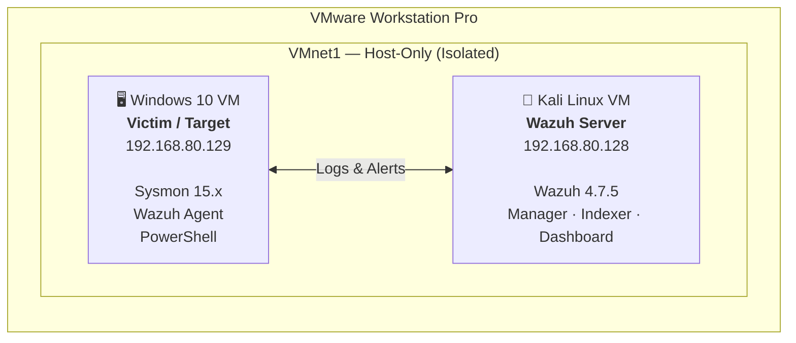

# 🛡️ Sysmon + Wazuh Endpoint Detection Lab

> A fully functional SOC home lab for endpoint threat detection, 
> malware analysis, and incident response simulation using 
> industry-standard tools.

## 📌 Project Overview

Built an isolated endpoint detection lab simulating real-world 
attacker behavior and malware activity. Deployed Sysmon for 
deep endpoint telemetry and Wazuh as the SIEM to collect, 
analyze, and alert on suspicious behavior — all mapped to the 
MITRE ATT&CK framework.

This lab replicates Tier 1-2 SOC analyst workflows including:
- Endpoint log collection and analysis
- Custom detection rule development
- Malware behavior simulation and validation
- Alert triage and incident documentation

---

## 🏗️ Lab Architecture

Isolated host-only network (`VMnet1`) with endpoint telemetry flowing from Windows 10 to the Wazuh stack on Kali Linux.



<details>
<summary>ASCII diagram</summary>

```
┌──────────────────────────────────────────────────────────────┐
│                   VMware Workstation Pro                      │
│                                                               │
│     ┌─────────────────────┐       ┌─────────────────────┐     │
│     │    Windows 10 VM    │       │    Kali Linux VM    │     │
│     │   (Victim/Target)   │       │   (Wazuh Server)    │     │
│     │                     │       │                     │     │
│     │  • Sysmon 15.x      │       │  • Wazuh 4.7.5      │     │
│     │  • Wazuh Agent  ◄──►│       │  • Manager          │     │
│     │  • PowerShell       │       │  • Indexer          │     │
│     │  192.168.80.129     │       │  • Dashboard        │     │
│     └─────────────────────┘       │  192.168.80.128     │     │
│                                   └─────────────────────┘     │
│              VMnet1 — Host-Only (Isolated Network)            │
└──────────────────────────────────────────────────────────────┘
```

</details>

---

## 🧰 Tools & Technologies

| Tool | Version | Purpose |
|------|---------|---------|
| VMware Workstation Pro | 25H2 | Hypervisor |
| Windows 10 Pro | 22H2 | Victim endpoint |
| Kali Linux | 2026.1 | Wazuh server |
| Sysmon | 15.x | Endpoint telemetry |
| SwiftOnSecurity Config | Latest | Sysmon ruleset |
| Wazuh SIEM | 4.7.5 | Log analysis + alerting |
| PowerShell | 5.1 | Attack simulation |
| Atomic Red Team | Latest | Malware simulation |

---

## 🎯 Detection Rules Built

| Rule ID | MITRE Technique | Description | Severity |
|---------|----------------|-------------|----------|
| 100001 | T1003 | Credential dumping via lsass access | Critical (12) |
| 100002 | T1547.001 | Registry Run key persistence | High (10) |
| 100003 | T1059 | Suspicious process from Office app | Medium (8) |
| 100004 | T1033 | Whoami reconnaissance execution | Medium (6) |
| 100005 | T1543 | New service creation via sc.exe | High (10) |

---

## 🦠 Malware Analysis Component

### Malware Samples Analyzed
- EICAR test file (safe antivirus test)
- PowerShell-based RAT simulation
- Mimikatz credential dumping simulation
- Persistence mechanism via registry

### Analysis Approach
1. Static analysis — file hashes, strings, PE headers
2. Dynamic analysis — behavior monitoring via Sysmon
3. Network analysis — connection attempts logged
4. Alert validation — confirmed detection in Wazuh

---

## 📊 Lab Results

- ✅ 577+ security alerts generated
- ✅ Custom Rule 100004 fired on reconnaissance
- ✅ MITRE ATT&CK techniques mapped and detected
- ✅ Credential dumping attempt detected
- ✅ Registry persistence detected and alerted
- ✅ Full attack chain simulated and documented

---

## 📸 Lab Walkthrough (Screenshots)

Full step-by-step visual documentation: [screenshots/README.md](screenshots/README.md)

| Step | Screenshot | Description |
|------|-----------|-------------|
| 1 | [wazuh-installation-complete.png](screenshots/wazuh-installation-complete.png) | Wazuh installer completed on Kali — indexer, manager, Filebeat, dashboard |
| 2 | [Wazuh.png](screenshots/Wazuh.png) | First login to Wazuh web UI with generated credentials |
| 3 | [wazuh-dashboard-no-agent.png](screenshots/wazuh-dashboard-no-agent.png) | Dashboard live — 0 agents connected |
| 4 | [sysmon-installed-verified.png](screenshots/sysmon-installed-verified.png) | Sysmon64 installed and verified on Windows 10 |
| 5 | [windows10-wazuh-agent-running.png](screenshots/windows10-wazuh-agent-running.png) | Wazuh agent service running on endpoint |
| 6 | [wazuh-dashboard-agent-connected.png](screenshots/wazuh-dashboard-agent-connected.png) | 1 active agent — DESKTOP-2HIJ3CV reporting |
| 6 | [Window_Agent.png](screenshots/Window_Agent.png) | Agent details — Windows 10 Pro, IP 192.168.80.130 |
| 7 | [wazuh-manager-running-kali.png](screenshots/wazuh-manager-running-kali.png) | Custom rules deployed, manager active |
| 8 | [windows10-attack-simulation-registry.png](screenshots/windows10-attack-simulation-registry.png) | Attack simulation — registry persistence, recon |
| 9 | [sysmon-eventviewer-logs.png](screenshots/sysmon-eventviewer-logs.png) | Sysmon capturing Process Create, Registry, File events |
| 10 | [wazuh-security-events-577-alerts.png](screenshots/wazuh-security-events-577-alerts.png) | 577 alerts with MITRE ATT&CK mappings |
| 10 | [wazuh-security-events-host.png](screenshots/wazuh-security-events-host.png) | Security events filtered by host agent |
| 11 | [wazuh-security-alerts-detailed.png](screenshots/wazuh-security-alerts-detailed.png) | T1105, T1033, T1059.003 detected and mapped |
| 12 | [Benchmark.png](screenshots/Benchmark.png) | CIS Windows 10 Benchmark — 394 checks, 32% score |

---

## 📁 Repository Structure

```
sysmon-wazuh-endpoint-lab/
│
├── 📄 README.md
│
├── 📂 architecture/
│   └── lab-diagram.png
│
├── 📂 sysmon-config/
│   └── sysmonconfig.xml
│
├── 📂 wazuh-rules/
│   └── local_rules.xml
│
├── 📂 simulations/
│   ├── simulate_attacks.ps1
│   ├── persistence_sim.ps1
│   └── recon_sim.ps1
│
├── 📂 malware-analysis/
│   ├── README.md
│   ├── static-analysis.md
│   └── dynamic-analysis.md
│
├── 📂 screenshots/                    ← Lab walkthrough (14 images)
│   ├── README.md
│   ├── wazuh-installation-complete.png
│   ├── Wazuh.png
│   ├── wazuh-dashboard-no-agent.png
│   ├── sysmon-installed-verified.png
│   ├── windows10-wazuh-agent-running.png
│   ├── wazuh-dashboard-agent-connected.png
│   ├── Window_Agent.png
│   ├── wazuh-manager-running-kali.png
│   ├── windows10-attack-simulation-registry.png
│   ├── sysmon-eventviewer-logs.png
│   ├── wazuh-security-events-577-alerts.png
│   ├── wazuh-security-events-host.png
│   ├── wazuh-security-alerts-detailed.png
│   └── Benchmark.png
│
└── 📂 docs/
    ├── setup-guide.md
    ├── detection-rules-explained.md
    └── incident-report-template.md
```

---

## 🚀 Setup Guide

See [docs/setup-guide.md](docs/setup-guide.md) for full 
installation and configuration steps.

---

## 🔗 References

- [Wazuh Documentation](https://documentation.wazuh.com)
- [SwiftOnSecurity Sysmon Config](https://github.com/SwiftOnSecurity/sysmon-config)
- [MITRE ATT&CK Framework](https://attack.mitre.org)
- [Atomic Red Team](https://github.com/redcanaryco/atomic-red-team)
