# Lab Walkthrough — Screenshots

Visual documentation of the Sysmon + Wazuh endpoint detection lab build, from installation through attack simulation and alert validation.

---

## Step 1 — Wazuh Installation Complete

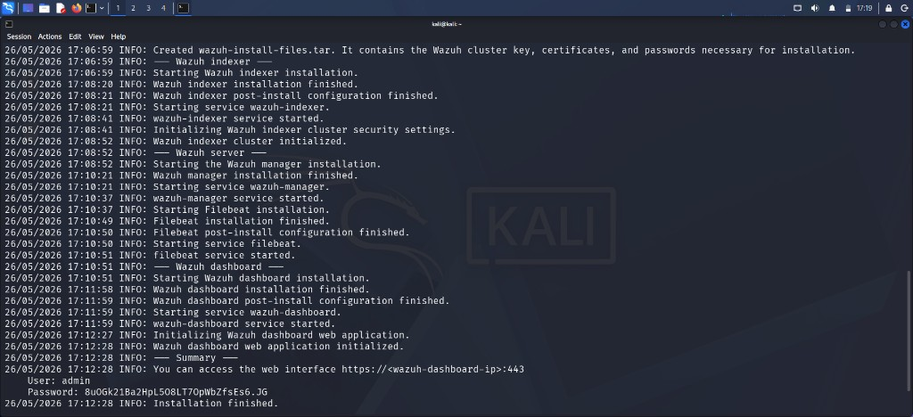

Ran the Wazuh installer on Kali. Terminal shows full sequence: indexer → manager → Filebeat → dashboard, all completing successfully with credentials generated.

---

## Step 2 — Wazuh Login

Used the generated credentials to log into the Wazuh web UI for the first time.

---

## Step 3 — Dashboard (No Agents)

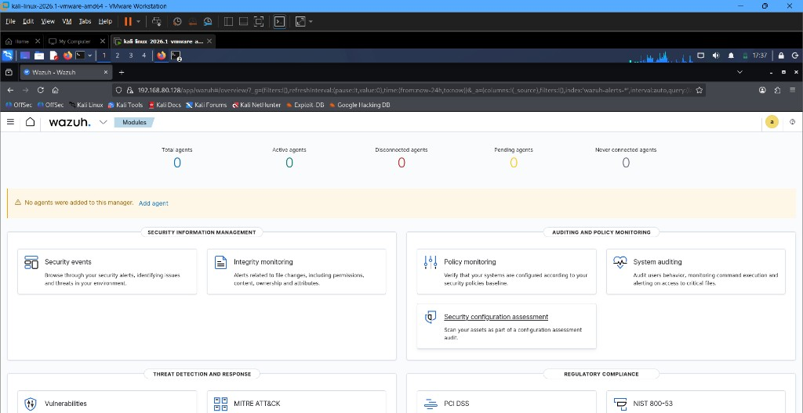

Dashboard loads — all agent counters show 0. Manager is up but no endpoints connected yet.

---

## Step 4 — Sysmon Installed & Verified

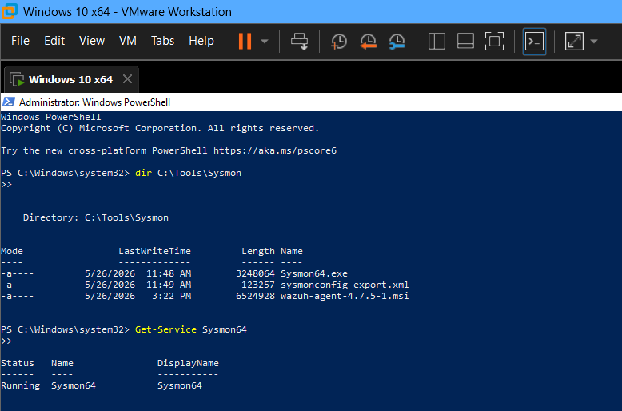

On Windows 10 VM, installed and verified Sysmon64. `Get-Service Sysmon64` shows **Running**.

---

## Step 5 — Wazuh Agent Running

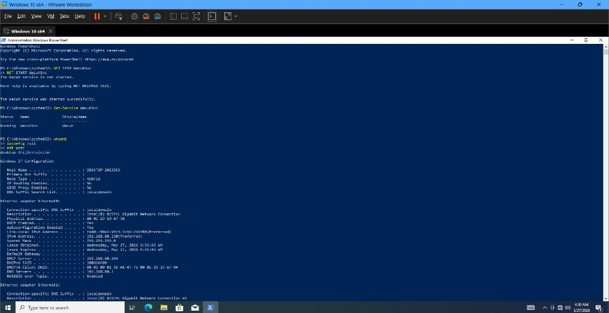

Installed and started Wazuh agent on Windows 10. `Get-Service WazuhSvc` confirms **Running**.

---

## Step 6 — Agent Connected

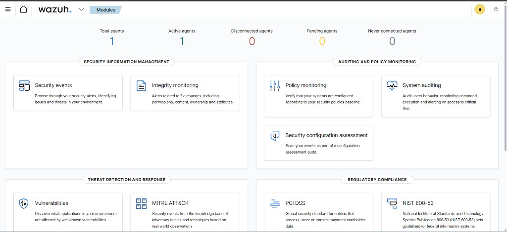

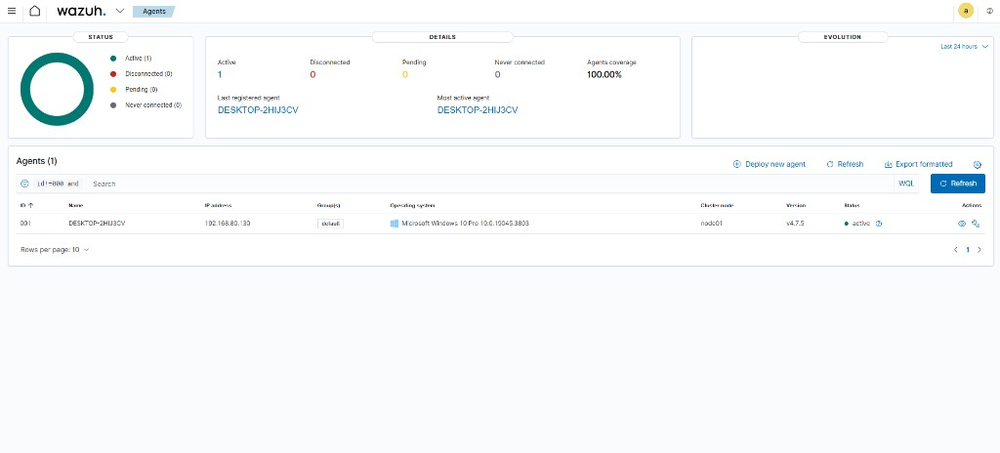

Dashboard now shows **1 Active agent** — `DESKTOP-2HIJ3CV` connected and reporting.

---

## Step 7 — Custom Rules Deployed

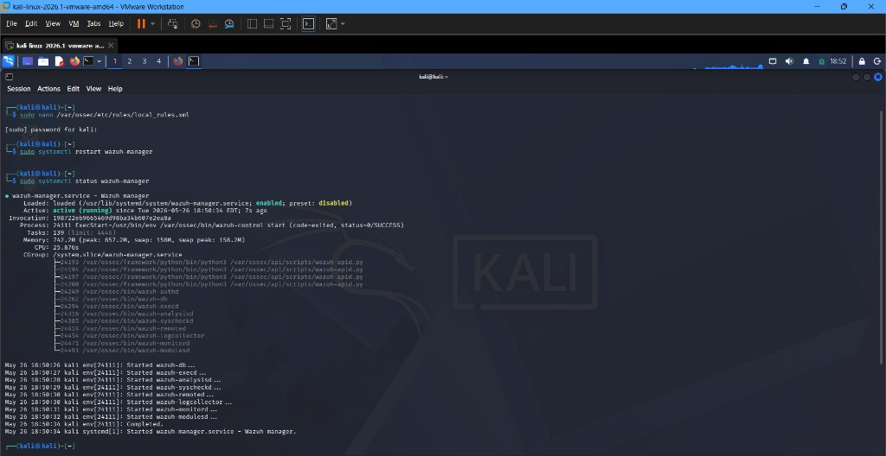

Edited `local_rules.xml` with custom detection rules, restarted manager. Confirmed **active (running)**.

---

## Step 8 — Attack Simulation

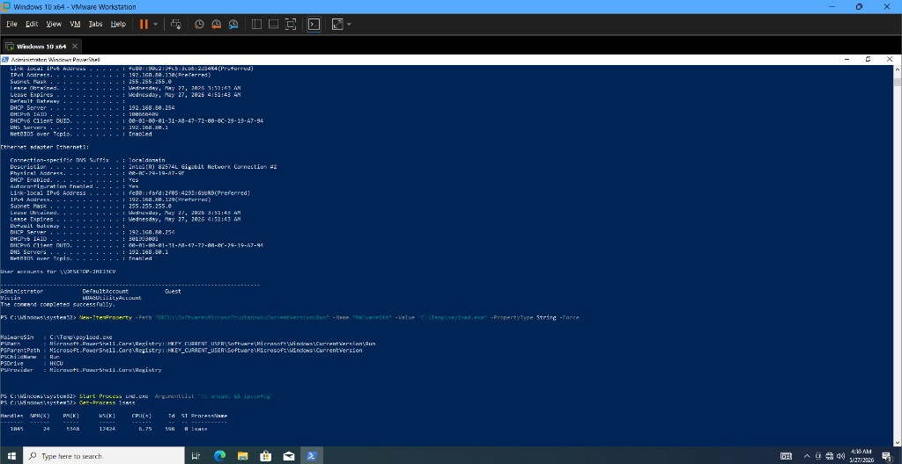

Ran attack simulation — registry persistence, whoami, ipconfig, lsass query via PowerShell.

---

## Step 9 — Sysmon Event Logs

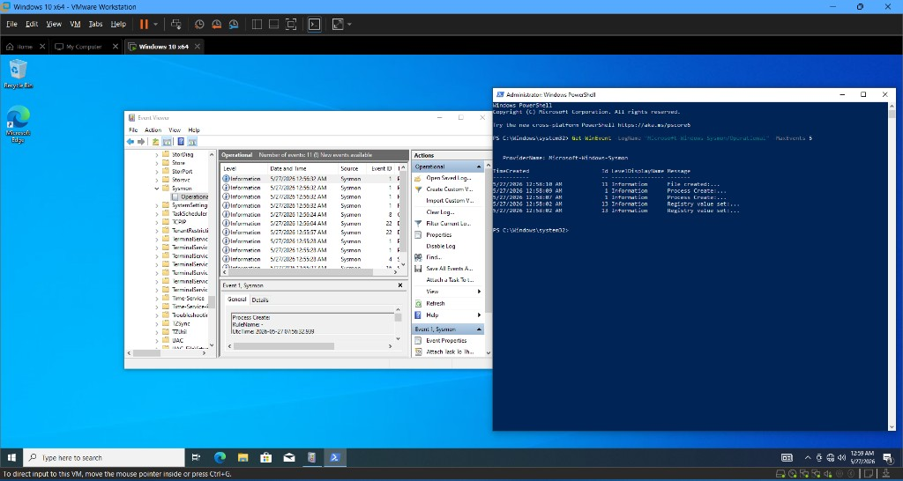

Sysmon capturing all attack events in Event Viewer — Process Create, Registry value set, File created.

---

## Step 10 — 577 Security Alerts

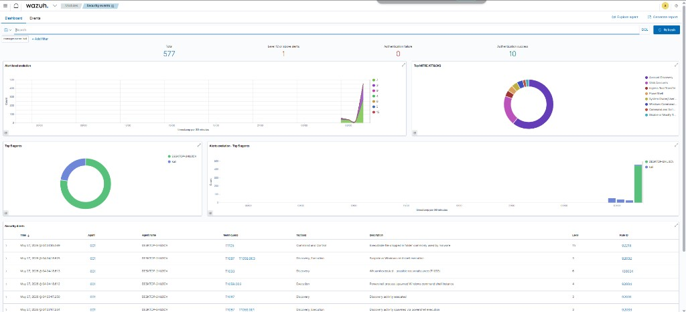

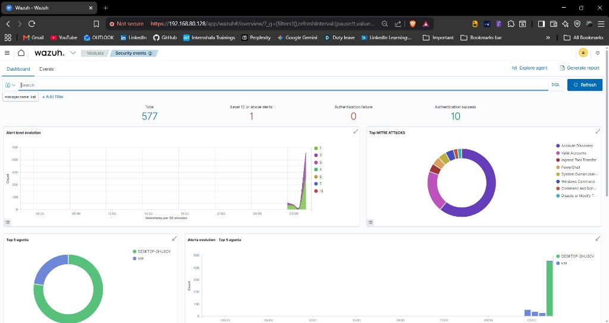

Wazuh dashboard shows **577 alerts** with MITRE ATT&CK mappings populated.

---

## Step 11 — Detailed Alert Table

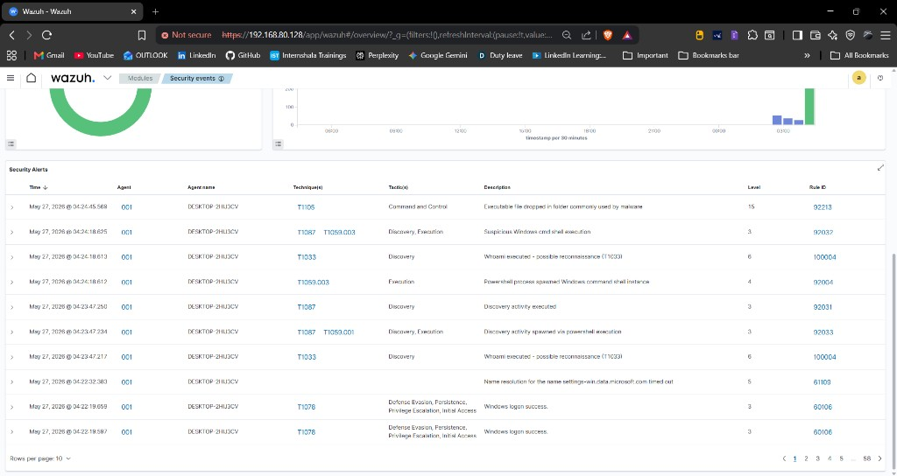

Detailed alert table with **T1105** (Level 15), **T1033**, **T1059.003** all detected and mapped.

---

## Step 12 — CIS Benchmark Scan

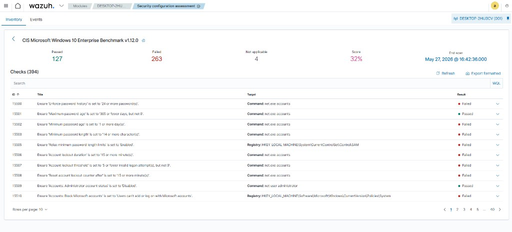

CIS Windows 10 Benchmark scan — **394 checks**, 127 passed, 263 failed, **32% score**.
